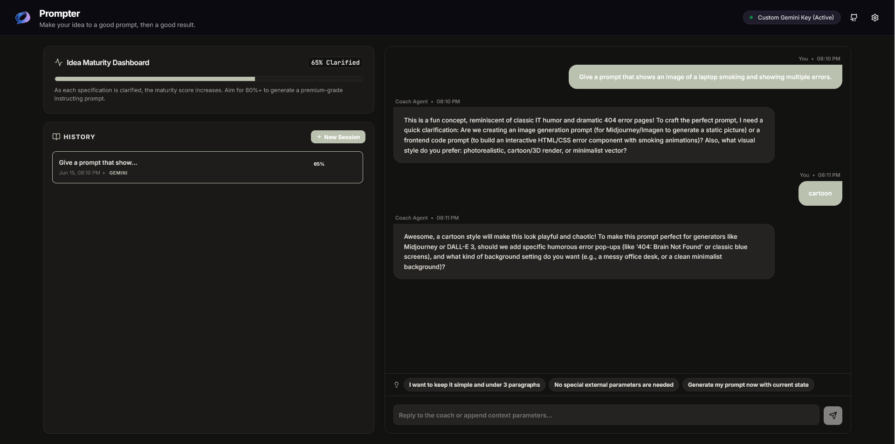
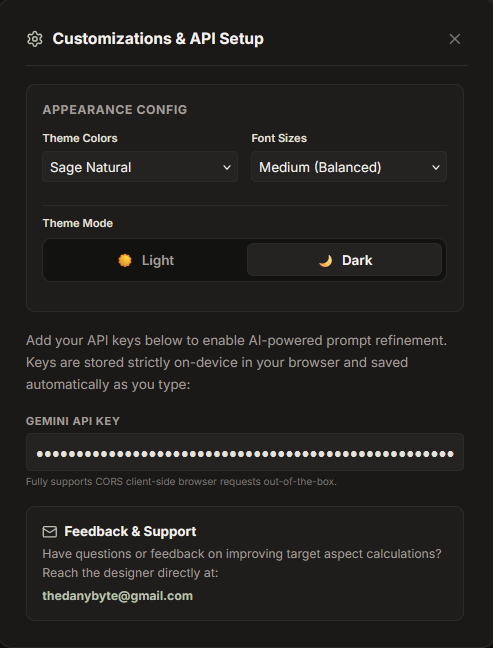

# Prompter

## Prompter is a opensource project that can make your idea to a powerful prompt to make them with AIs.

The user fully explains the main idea to the AI, the AI ​​understands the idea and tries to add more details to that idea, for example, if the user wants to make a photo, it asks the user to tell him the type of photo (realistic, anime...) or the technologies he wants to use for a site. When Clarified reaches 100%, the user receives the final prompt

## What Prompter Does

Prompter is a conversational AI coach that transforms raw, half-formed ideas into production-ready system prompts optimized for AI models like Gemini. Instead of requiring you to craft a complex prompt yourself, Prompter interviews you through a guided, multi-turn dialogue — asking clarifying questions, suggesting features, detecting problems, and progressively building a complete specification until it can compile the final prompt for you.



## How Prompter Creates Its Own Prompt

Prompter's ability to generate prompts is not a simple template fill-in. It is a multi-layered system built on several interconnected mechanisms:

### 1. Expert System Instruction

At the core is a 68-line system instruction (`src/shared/getSystemInstruction.ts`) that turns the AI into a multi-role entity — part Prompt Engineering Coach, part Idea Generator, part Technical Co-Founder. This instruction defines 8 mandatory duties: understanding ideas with real-world references, brainstorming features proactively, selecting technology stacks, conducting deep interviews, detecting logical flaws, compiling the final prompt, supporting every human language, and adapting UI/UX discussion for visual projects. The AI does not simply respond — it actively drives the conversation toward completeness.

### 2. Six-Aspect Specification Board

Prompter does not treat prompt creation as a single output. It decomposes every idea into 6 structured aspects, tracked in real time:

| Aspect | Weight | Purpose |
|---|---|---|
| **primaryGoal** | +20% | Core purpose or application |
| **targetAudience** | +15% | Who the prompt serves |
| **toneStyle** | +15% | Writing tone, persona, format style |
| **inputsRequired** | +15% | Runtime arguments, source material |
| **formatOutput** | +15% | Output structure (JSON, markdown, etc.) |
| **constraints** | +15% | Boundaries, word limits, negative rules |

Each turn of conversation updates these aspects. Fields remain empty until the user explicitly provides information — no placeholders allowed.

### 3. Maturity Rubric and Progress Scoring

A mathematical rubric calculates a **progressScore** (0–100%) by summing the weights of each clarified aspect. The AI is strictly instructed: a raw spark scores ~15-20%, and 80%+ requires at least 4 fully defined aspects. The final prompt is only generated when the score reaches 100% and the AI's self-analysis confirms quality. This prevents premature or half-baked prompt output.

### 4. Iterative Refinement Loop

Every user message triggers a structured JSON response containing:
- A **coaching message** (under 150 words) with the next clarifying question
- Updated **aspects** with captured details
- A **progressScore** reflecting current maturity
- An **isCompleted** flag
- A **finalPrompt** (only populated when `isCompleted` is true)

This loop continues until the specification is complete, ensuring the final prompt reflects the full depth of the user's intent.

### 5. Prompt Quality Self-Analysis

Before compiling the final prompt, the AI performs an internal quality gate — asking itself: Is the guidance clear? Is it actionable? Are there ambiguities? Would it produce consistent results? If any answer is "no," the AI asks targeted clarifying questions instead of finalizing. This ensures every generated prompt is optimized for AI comprehension and execution.

### 6. Structured Output via JSON Schema

Every AI response is constrained to a strict JSON schema with required fields (`message`, `aspects`, `progressScore`, `isCompleted`, `finalPrompt`). This is enforced both by the system instruction and by the `responseSchema` parameter sent to the Gemini API, guaranteeing machine-parseable, structured output at every turn.

### 7. Adaptive System Directives

Two dynamic directives are injected into the conversation depending on the stage:
- **ANALYZE directive**: Appended during refinement — instructs the AI to update aspects, calculate maturity, and ask one clarifying question.
- **FINALIZE directive**: Appended when the user requests prompt generation — instructs the AI to immediately set `isCompleted` to true and compile the final prompt.

This allows the same AI model to behave differently based on the conversation phase without reinitializing.

### 8. Technology Stack Guidance

For project-oriented prompts, the AI proactively helps users select and compare technology stacks (React vs Flutter, Firebase vs PostgreSQL, Stripe integration, etc.), locking in technical decisions before compilation. This transforms vague ideas like "build me a fitness app" into precise specifications including framework, database, deployment target, and UI requirements.

### 9. Problem Detection and Critical Evaluation

The AI is mandated to identify logical flaws, bottlenecks, and drawbacks in the user's idea — not just agree with everything. It collaborates with the user to resolve issues before the prompt is finalized, resulting in stronger, more robust final prompts.

### 10. Multilingual Prompt Generation

The system adapts to the user's language in real time. If a user writes in Spanish, Persian, Arabic, Chinese, or any other language, the entire conversation — coaching messages, aspect summaries, and the final prompt — are generated in that language. No forced English fallback.



## How to Run

Install dependencies:

```bash
npm install
```

Start the dev server (port 3000):

```bash
npm run dev
```

Then open [local on 3000 port](127.0.0.1:3000) in browser


## How to Get an API Key

You need a **Google Gemini API key**. You can provide it in two ways:
1. **Get free API** Get your free key at [Google AI Studio](https://aistudio.google.com/apikey).

2. **Add API key** 
- **via the app UI** — Open Settings in the app and paste your key.
- **via environment variable** — Create a `.env` file in the project root:

   ```
   GEMINI_API_KEY=your_api_key_here
   ```
